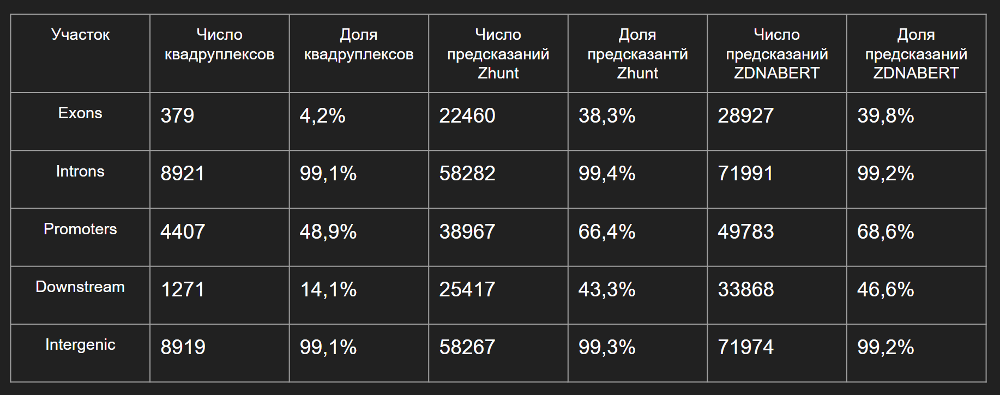
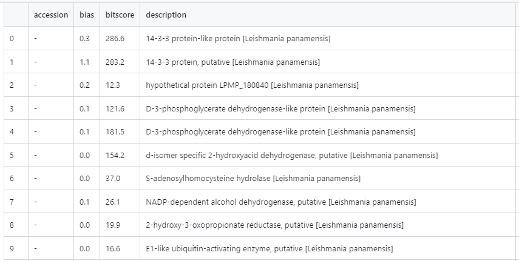

# Leishmania Panamensi (Belin Egor)

Ссылка на NCBI https://www.ncbi.nlm.nih.gov/datasets/genome/GCF_000755165.1/

Ссылки на колаб:

Часть 1 https://colab.research.google.com/drive/1blvFSPJ-UfKcNv8XEOVG-d76510EbDti?usp=sharing

Часть 2 https://colab.research.google.com/drive/1fwNX8_hfjorzJJrjyOtLXhFwWWkPIKTr?usp=sharing

## Краткое описание
Одноклеточный паразит, является возбудителем группы заболеваний (Лейшманиаз) переносчиками в основном являются москиты. Существует в основном в Центральной и Южной Америке Заболеванию подвержены люди и животные.

Гены связанные с синтезом lipophosphoglycan (LPG) являются критическим фактором для выживания  паразита в насекомых и млекопитающих. Они часто модифицируются добавлением carbohydrate side chains, которые изменяются на протяжении жизненного цикла

Название|N50|число генов| Длинна генома | Место обитания
----|----|----|----|----
Leishmania panamensis|1Mb|8048 (7711) |30,7 Mb| Ткания животных и людей

## Файлы
[файлы bed с результатами](bed_results)

[Геном](GCA_000755165.1_ASM75516v1_genomic.fna)

## Распределение структур по геному

## Таблица с генами связанными с эпигенетикой

Тут приведён лишь маленький фрагмен, так как сама таблица очень большая. полностью её можно посмотреть если перейти в [файл](hmmer_data.tsv).

